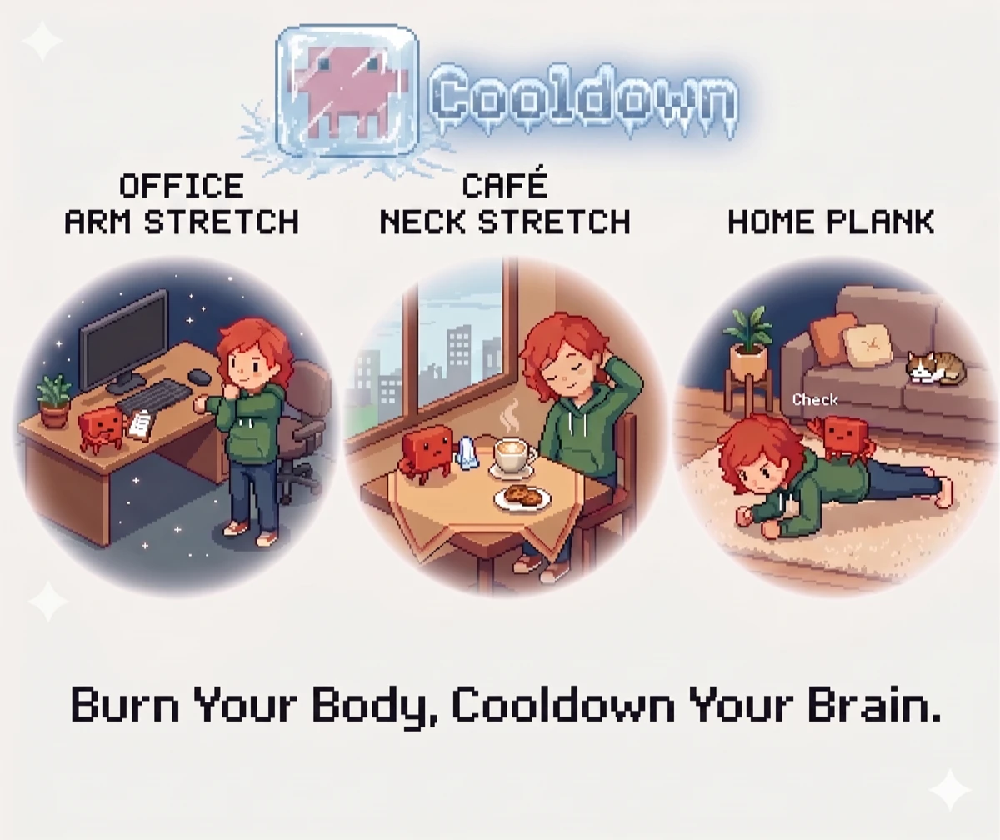

# Cooldown 🦀

**Burn Your Body, Cooldown Your Brain.**

> 等 coding agent 跑完的那几分钟，别干刷手机 —— 桌面上的小螃蟹递给你一张微健身卡，动一下。

**Cooldown** 是一只住在你桌面的小螃蟹。当它发现你在等 Claude Code / Codex 跑一个长任务、人停下来干等的时候，会递上一张微健身卡：按你所在的场合（工位 / 咖啡厅 / 家里）抽一个做得了的动作，跟着做完几组，螃蟹给你比个心。把「等编译、等 agent」的碎片时间，变成久坐身体的一次小回血。

别的桌宠在你等的时候卖萌，Cooldown 把等待变成 cooldown —— 给你的，也给 agent 的。

**适合人群**：vibe coder —— 整天跟 AI 结对、久坐写码的你。

---

## 它会做什么

- 🎯 **挑对时机弹**：只在你「真的在干等」时出现 —— agent 持续忙 + 你手停下来 + 在活跃时段 + 过了冷却，几个条件同时满足才弹，不打断你正敲得起劲的代码。
- 🃏 **按场景抽卡**：先选你在哪，它只发这个场合做得了的动作（工位不会让你开合跳）。六张牌背，翻开是惊喜。
- 💪 **按组训练**：不是干等 5 分钟 —— 跟着做组（计次 / 计时 / 左右各一组 / 组间休息），每张卡还写了这个动作怎么做，做完所有组才算完成。
- 📒 **本地记录**：完成 / 拒绝 / 小睡都记一笔，看连续打卡、本周完成、完成率。
- 🔕 **不烦人**：右上角 ⚙ 里有免打扰开关、弹卡频率（少 / 中 / 多）、静默时段。

---

## 安装（一条命令）

本机装了 `git` / `node` / `npm` 就行：

```bash
git clone https://github.com/Yolaaaaanda000/cooldown.git
cd cooldown
./install.sh      # 自动装好（可重复跑，不会重复注入）
./start.sh        # 启动，让小螃蟹上岗
```

想装到别的目录：`./install.sh /你要的/路径`，启动同理 `./start.sh /你要的/路径`。

---

## 用起来

启动后小螃蟹就待在桌面角落，该动的时候它自己会来，你不用管它。

- **想快点看到它弹卡**（试用 / 演示）：把 `design/triggers.json` 里的 `minBusySec` 改成 `8`，重启，然后随便让 agent 跑个活、你的手离开键盘几秒。
- **嫌太勤 / 想安静**：浮窗右上角 ⚙ → 开免打扰，或把弹卡频率调「少点」，或打开静默时段。
- **想换动作或加场景**：动作库和文案都在 `design/moves.json`，改完**下一次弹卡就生效，不用重启**（浮窗每次弹出都会重新读它）。

---

## 隐私

Cooldown 不联网、不收数据。运动记录只用浏览器本地存储存在你这台电脑上，清掉就没了。没有账号、没有云，也不碰屏幕使用时间统计。

---

## 许可与致谢

Cooldown 叠加在开源桌宠 [clawd-on-desk](https://github.com/rullerzhou-afk/clawd-on-desk)（负责桌宠形象 + 监听 coding agent + 透明悬浮窗）之上，本仓库只放 Cooldown 自己的卡片、动作内容与逻辑。

clawd-on-desk 是 **AGPL** 协议，所以 `install.sh` 不打包、不分发它，而是在**你自己的机器上**把它 clone 下来再装 —— 引擎是你装的、不是我们发的，Cooldown 自己的代码许可独立、干净。

---

<p align="center">
  
</p>

🦀 动完这一下，螃蟹给你比个心。
